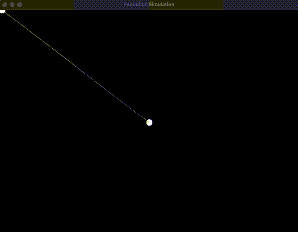

# Pendulum-Cmulation

Simple, real‑time pendulum simulation in C using SDL2. This project models a frictionless pendulum and renders its motion in a graphical window.

## Demo



## Requirements

- C compiler
- SDL2 library
- CMake

*if you're using a different compiler than GCC you need to modify the compiler settings in Makefile.*

## Building

In the project folder run
```
make
build/pendulum
```

For cleanup run
```
make clean
```
